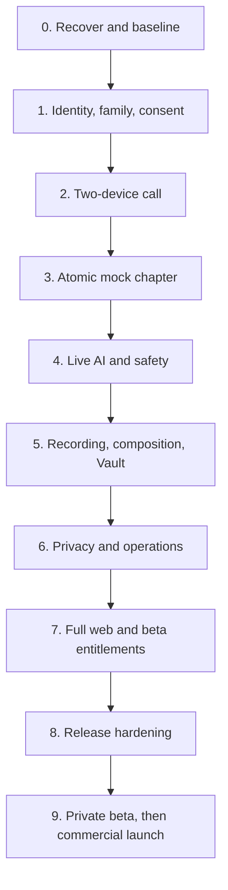

# StoryTime Implementation Plan

| Field            | Value                                          |
| ---------------- | ---------------------------------------------- |
| Status           | Canonical autonomous delivery plan             |
| Version          | 1.0                                            |
| Last updated     | 2026-07-16                                     |
| Product source   | [PRD.md](PRD.md)                               |
| Current evidence | [docs/current-state.md](docs/current-state.md) |
| Delivery tracker | Linear: `StoryTime MVP Delivery`               |

This plan takes the existing scaffold to a deployed, verified web+iOS+Android product. It is ordered around the complete atomic chapter, not horizontal layers or polished mock screens.

## 1. Delivery objective

The implementation is complete only when an authorized family can, on production-capable web/iOS/Android clients:

1. establish adult identity, family trust, child profile, and valid consent;
2. notify and connect two trusted adults;
3. verify the adult lobby and child handoff before recording;
4. choose and lock a story seed;
5. alternate submitted baton turns through safe live AI;
6. record separate tracks and an ordered event ledger;
7. end and asynchronously compose a verified private replay;
8. replay/continue it from the Vault;
9. delete it end-to-end;
10. reconcile chapter usage/cost;
11. operate and recover the system safely.

The preserved `agent/live-foundation` work supplies initial Clerk, LiveKit, provider-readiness, and guarded AI adapters. Those foundations are evidence for the packages below, not proof that their end-to-end acceptance gates are complete.

A static demo, mock provider, placeholder script, web-only flow, typecheck-only mobile app, unverified deployment, or uncomposed recording is not completion.

## 2. Execution rules

### 2.1 Work-package states

- `NOT_STARTED`
- `IN_PROGRESS`
- `BLOCKED_EXTERNAL`
- `IN_REVIEW`
- `DONE_VERIFIED`
- `SUPERSEDED`

Only `DONE_VERIFIED` counts toward phase completion.

Initial registry state was superseded by the live evidence in [docs/current-state.md](docs/current-state.md). As of 2026-07-16, the integration branch and draft PR #2 put `ST-000` and `ST-002` in review; the reproducible workspace, truthful checks, and CI provide evidence for `ST-003`–`ST-005`; `ST-007` and `ST-009` are in progress; and the measured synthetic compositor provides `ST-012` evidence. Unmerged work and partial Linear status do not count as phase completion.

Scheduling is deterministic: select the lowest numbered phase whose exit is incomplete, then the first `NOT_STARTED` package in that phase whose earlier required rows and explicit dependencies are `DONE_VERIFIED`. Work explicitly listed as safe parallelism may start concurrently; security/privacy blockers outrank numeric order.

All Phase 0–8 packages are beta `P0` unless their row says otherwise. Phase 9 packages `ST-900`–`ST-908` govern staged beta evidence; `ST-911`–`ST-916`, `ST-909`, and `ST-910` are commercial `P0` only after the pricing decision. Here `P0` means release-blocking priority, not Phase 0.

### 2.2 One package, one proof

Each work package should normally produce one reviewable PR with:

- linked package/Linear issue;
- implemented scope and explicit exclusions;
- tests and evidence;
- migrations/rollback where applicable;
- documentation/status update;
- no unrelated changes or secrets.

Split a package if review becomes unsafe. Combine only tightly coupled mechanical work.

### 2.3 Phase gate

A phase closes only when:

- all P0 packages applicable to that release stage are `DONE_VERIFIED`;
- its exit scenario passes in a clean environment;
- the root checks are green;
- no critical/high defect in its scope remains;
- current state and Linear agree with code.

### 2.4 External blockers

Missing Apple/Google accounts, final legal approval, production VPC contract, price approval, or store review can block the relevant external release action. They do not justify stopping independent code, tests, synthetic environments, documentation, or preview deployment.

## 3. Delivery shape

Native call delivery, design system, observability, security, and test automation begin early and mature across phases; they are not deferred wholesale to Phase 8.

## 4. Phase 0 — Recover, reconcile, and make the baseline truthful

**Outcome:** one reviewed integration branch, pinned reproducible toolchain, canonical docs, truthful CI, reconciled backlog, and measured risk spikes.

### Work packages

| ID       | Deliverable                             | Acceptance                                                                                                                                |
| -------- | --------------------------------------- | ----------------------------------------------------------------------------------------------------------------------------------------- |
| `ST-000` | Canonical source-of-truth pack          | PRD, architecture, state machines, privacy, tests, plan, AGENTS, README, and current state agree; no placeholder claims                   |
| `ST-001` | Preserve/review `agent/live-foundation` | Branch diff reviewed; auth/provider/media risks recorded; no commit lost                                                                  |
| `ST-002` | Integration PR                          | Live-foundation and canonical docs reconciled on a feature branch; reviewable PR to `main`                                                |
| `ST-003` | Pinned workspace                        | Node 22, Corepack, pnpm 9.15.9, committed lockfile, clean frozen install                                                                  |
| `ST-004` | Truthful scripts                        | Root format/lint/type/unit/integration/build commands; placeholder `echo` gates fail until implemented                                    |
| `ST-005` | CI baseline                             | Required GitHub PR jobs run on clean checkout with caching and no silent allow-failure                                                    |
| `ST-006` | Environment capability model            | Typed dev/preview/prod capabilities; production refuses mock/missing identity, consent, LiveKit, storage, AI/safety, recording, deletion  |
| `ST-007` | Linear reconciliation                   | 60 legacy issues compared with code; stale setup issues closed/updated; partial tickets split; new phase/package mapping created          |
| `ST-008` | Secret/repository protection            | Secret scan clean; GitHub secret scanning/push protection/branch rules enabled where account supports it                                  |
| `ST-009` | Deployment/account inventory            | Convex, Vercel, LiveKit, R2, Clerk, AI, EAS, Apple, Google, monitoring, billing, consent provider status recorded without secrets         |
| `ST-010` | LiveKit spike                           | Web↔mobile and mobile↔mobile join/reconnect; separate-track egress feasibility and timing measured using synthetic media                  |
| `ST-011` | AI-turn spike                           | Bounded synthetic audio through STT→structured story→safety→image/fallback; latency and cost measured                                     |
| `ST-012` | Composition spike                       | Two synthetic tracks + ledger → 720p replay; sync, duration, CPU, scratch, storage measured                                               |
| `ST-013` | Architecture decision closure           | Decision log records queue, worker runtime, web scope, retention defaults, output format, state migration, and branch recovery            |
| `ST-014` | Child-data provider controls            | OpenAI ZDR approval status, Groq ZDR, fal no-store/private ACL, processor terms, deletion, and capability checks recorded without secrets |
| `ST-015` | Region/native compatibility closure     | Launch region map selected; Expo/RN/LiveKit versions pinned; physical iOS/Android native media build passes                               |

### Exit scenario

From a clean clone using Node 22:

- frozen install succeeds;
- every implemented root gate is real and green;
- preview web builds;
- mobile config/bundle validation succeeds;
- worker image builds;
- three spikes have evidence;
- the integration PR includes no secret and no unresolved critical finding;
- Linear matches the verified baseline.

## 5. Phase 1 — Adult identity, family trust, and consent

**Outcome:** an authenticated adult can create a family and synthetic child profile, invite/revoke a second adult, complete a non-production consent sandbox, and be authorized correctly across web/mobile.

### Domain and backend

| ID       | Deliverable                 | Acceptance                                                                                                |
| -------- | --------------------------- | --------------------------------------------------------------------------------------------------------- |
| `ST-100` | Clerk→internal user binding | Trusted auth-context identity; idempotent create/update/disable/delete; no caller-provided identity trust |
| `ST-101` | Family tenant model         | Family owner, status, region/config version, indexes, migration                                           |
| `ST-102` | Membership/RBAC policy      | Owner/guardian/approved-adult capabilities centralized and exhaustively tested                            |
| `ST-103` | Consent-first child profile | Expiring minimal provisional slot; named profile only after verified VPC; no login/public identifier      |
| `ST-104` | Invitation lifecycle        | Hashed single-use token, role/scope, expiry, accept/decline/revoke/resend                                 |
| `ST-105` | Trusted device/push record  | Environment-scoped device, platform, token reference, last seen, revocation                               |
| `ST-106` | Consent grant lifecycle     | Versioned scopes/evidence/provider/status/expiry/withdrawal/supersede                                     |
| `ST-107` | Recording acceptance model  | Per-adult, per-chapter notice acceptance and server-derived authority                                     |
| `ST-108` | Authorization matrix        | Cross-family/resource/action negative integration suite                                                   |
| `ST-109` | Audit events                | Content-free high-risk action evidence with retention configuration                                       |

### Client surfaces

| ID       | Deliverable                     | Acceptance                                                                                              |
| -------- | ------------------------------- | ------------------------------------------------------------------------------------------------------- |
| `ST-110` | Web/mobile sign-in and recovery | Supported adult auth methods; safe redirect/deep link; error/retry states                               |
| `ST-111` | Family onboarding               | Create family and first child profile on web/mobile                                                     |
| `ST-112` | Family/invitation management    | Pending/accepted/expired/revoked states; role clarity; recent auth                                      |
| `ST-113` | Protected consent flow          | Provider-hosted/sandbox adapter; notices/scopes; fail-closed state                                      |
| `ST-114` | Child-mode route boundary       | Adult-only routes/actions denied through UI, deep link, and server                                      |
| `ST-115` | Local adult re-auth             | Biometric/passcode fallback for handoff and child-mode exit; wording verifies local guardian only       |
| `ST-116` | Trust/legal page baseline       | Privacy, child privacy, recording/AI/deletion explanation tied to stored versions                       |
| `ST-117` | Child notice and stop/help      | Age-appropriate explanation before capture; persistent control drives server stop/pause and adult alert |

### Exit scenario

Two synthetic adults on separate clients share one synthetic child profile through an expiring invitation. Revocation immediately denies protected resources. Every invalid consent state blocks a child session. No cross-family test escapes.

## 6. Phase 2 — Reliable two-device call and handoff

**Outcome:** two trusted adults can start, receive, accept, join, authenticate, hand off, reconnect, and end an unrecorded-to-recorded-boundary call with no AI.

### Work packages

| ID       | Deliverable                    | Acceptance                                                                                             |
| -------- | ------------------------------ | ------------------------------------------------------------------------------------------------------ |
| `ST-200` | Canonical call state machine   | Persisted typed states/version/idempotency; migration from scaffold status                             |
| `ST-201` | Call creation/claim            | Validate family/profile/consent/entitlement/conflict; first valid accept wins                          |
| `ST-202` | Notification job               | Expo/APNs/FCM abstraction; minimal payload; expiry/cancel/deduplicate                                  |
| `ST-203` | Native incoming-call UX        | iOS/Android policy-compliant alert, deep link, declined/missed/already-answered                        |
| `ST-204` | Web call notification          | In-app presence and optional web push; expiry/cancel                                                   |
| `ST-205` | LiveKit token service          | Scoped adult-lobby and distinct child-mode identities; no child token before authority                 |
| `ST-206` | Shared connection model        | Joining/connected/reconnecting/audio-first/failed/ended semantics                                      |
| `ST-207` | Web LiveKit adapter            | Publish/subscribe/device selection/permissions/reconnect/cleanup                                       |
| `ST-208` | Mobile LiveKit adapter         | Development-build native integration, permissions, background/interruption/reconnect                   |
| `ST-209` | Adult lobby                    | Adult identities visible/audible; adult-only instruction; recording/AI off                             |
| `ST-210` | Handoff/authority gate         | Commit auth/acceptance/consent; supervisor unpublishes; distinct child joins; recording precedes setup |
| `ST-211` | Network degradation            | Audio priority, video suspension/resume, visible state, ledger-ready events                            |
| `ST-212` | Presence and duplicate clients | Idempotent participant identity, heartbeats, stale cleanup                                             |
| `ST-213` | End/cancel cleanup             | Room/session terminal state; notifications/tokens invalid; no orphan                                   |
| `ST-214` | Call metrics                   | Funnel, join latency, reconnect, failure code without content                                          |
| `ST-215` | Two-device E2E matrix          | Mobile↔mobile, web↔mobile, supported web↔web; physical iOS/Android smoke                               |

### Exit scenario

A remote adult starts a call, the nearby adult receives it outside the app, accepts once, joins the unrecorded lobby, confirms identity/consent/handoff, enters child mode, survives a 30-second network drop, and ends cleanly. Instrumentation proves no child media or recording before authority.

## 7. Phase 3 — Complete atomic chapter with mock providers

**Outcome:** the real clients and backend complete, persist, and replay a synthetic/mock chapter workflow before live provider complexity.

### Domain and state

| ID       | Deliverable                 | Acceptance                                                                             |
| -------- | --------------------------- | -------------------------------------------------------------------------------------- |
| `ST-300` | Chapter model/state machine | Call/chapter/recording/composition separated; typed versions/transitions               |
| `ST-301` | Adventure continuity model  | Lightweight adventure title/summary/chapter numbering; deletion semantics              |
| `ST-302` | Five-part seed              | Validated catalog/custom path, attribution, immutable lock                             |
| `ST-303` | Server baton                | Holder/version/expiry; atomic submit/pass/cancel; concurrency property tests           |
| `ST-304` | Turn model                  | Bounded audio interval, lifecycle, attempt/artifact links, idempotency                 |
| `ST-305` | Ordered timeline ledger     | Atomic sequence, relative/wall time, versions, idempotent event append                 |
| `ST-306` | Checkpoint/ending/pause     | 15-minute checkpoint, 5-minute extension, 30-minute hard limit; saved chapter boundary |

### UX and mock vertical slice

| ID       | Deliverable               | Acceptance                                                                     |
| -------- | ------------------------- | ------------------------------------------------------------------------------ |
| `ST-307` | Semantic tokens           | Prototype palette/spacing/type/motion extracted with accessibility corrections |
| `ST-308` | Native UI primitives      | Button/card/text/screen/badge/modal/progress/avatar/recording/status tested    |
| `ST-309` | Web UI primitives         | Accessible equivalents, focus/keyboard/reduced-motion states                   |
| `ST-310` | Adult dashboard           | Presence/call CTA/recent chapters/storage/readiness; real state                |
| `ST-311` | Setup wizard              | Five alternating choices and seed-lock confirmation on web/mobile              |
| `ST-312` | Story room                | Scene, both participants, baton, recording/network status, captions            |
| `ST-313` | Submitted-turn capture    | Exact start/end interval sealed; max duration; cancel/retry                    |
| `ST-314` | Mock Story Director       | Deterministic fixtures with schema/safety/fallback and synthetic scene assets  |
| `ST-315` | Realtime scene sync       | Same ordered version on both clients under duplicate/out-of-order delivery     |
| `ST-316` | Loading/fallback          | Immediate acknowledgement and approved theatrical fallback                     |
| `ST-317` | Checkpoint/pause/end UI   | Private adult choice, recent auth where needed, child-safe outcome             |
| `ST-318` | Placeholder replay record | Stopped chapter appears in Vault with processing/ready synthetic rendition     |
| `ST-319` | Full mock-chapter E2E     | Setup→8 turns→fallback→checkpoint→ending→Vault on web/iOS/Android              |

### Exit scenario

Two real clients complete an eight-turn synthetic chapter using authoritative state and deterministic providers. Duplicate submissions and disconnects do not diverge clients. A chapter record and mock rendition appear in the Vault. All routes are real, not static demo pages.

## 8. Phase 4 — Live AI, safety, and cost

**Outcome:** only submitted turn audio flows through production-capable STT, structured story, moderation, image generation, safe publication, and usage accounting.

### Work packages

| ID       | Deliverable                   | Acceptance                                                                                       |
| -------- | ----------------------------- | ------------------------------------------------------------------------------------------------ |
| `ST-400` | Durable typed job foundation  | Atomic claim/lease/heartbeat/retry/cancel/dead-letter; worker restart tests                      |
| `ST-401` | Job dispatcher/concurrency    | Separate turn/media/deletion limits; backpressure and health                                     |
| `ST-402` | Private turn-audio upload     | Bounded object/checksum/authorization/retention; no client provider key                          |
| `ST-403` | STT adapter                   | Groq/selected provider, timeout/error normalization, fixture contracts                           |
| `ST-404` | Transcript safety             | Age-banded decision/replacement before story generation                                          |
| `ST-405` | Structured Story Director     | OpenAI/selected provider, strict schema/length/context, one repair                               |
| `ST-406` | Text/prompt safety            | Beat/caption/next/image prompt gate; redacted events                                             |
| `ST-407` | Image adapter                 | fal/selected provider, private output, timeout/cost, deterministic fallback                      |
| `ST-408` | Image safety                  | Pre-publication provider/approved strategy; no unreviewed child display                          |
| `ST-409` | Artifact/version model        | Provider/model/prompt/policy/schema versions and lineage                                         |
| `ST-410` | End-to-end turn orchestration | Idempotent stage results and one displayed scene per logical turn                                |
| `ST-411` | Circuit breaker/capability    | Health, rate limit, budgets, no live→mock production fallback                                    |
| `ST-412` | Usage ledger                  | Attempts, seconds/tokens/calls/bytes, price version, estimate                                    |
| `ST-413` | Safe fallback catalogue       | Pre-reviewed age-band scenes/captions/endings, versioned                                         |
| `ST-414` | Synthetic safety eval         | Prompt injection/PII/adult themes/harm/noise/malformed/image suite                               |
| `ST-415` | Latency/cost benchmark        | P95 text ≤5s, scene/fallback ≤12s or explicit approved revision                                  |
| `ST-416` | Privacy/log verification      | No transcript/prompt/media/signed URL/secret in logs/analytics                                   |
| `ST-417` | OpenAI child-data gate        | ZDR approval + non-storage request + refusal/incomplete handling; fail closed without capability |
| `ST-418` | STT privacy/cost gate         | Closed private clips, ZDR, URL expiry/deletion, short-turn latency and minimum-billing benchmark |
| `ST-419` | Image privacy gate            | De-identified prompts, no-store/private ACL, immediate R2 copy, no provider URL in clients       |

### Exit scenario

A synthetic submitted audio interval produces one safe live scene on both clients. Unsafe and malformed fixtures produce approved replacements. A provider outage preserves the call. The chapter ledger records versions and cost without logging family content.

## 9. Phase 5 — Raw recording, deterministic composition, and Vault

**Outcome:** real separate tracks and ordered events produce a private, verified replay with retry/recovery and retention.

### Recording/storage

| ID       | Deliverable                     | Acceptance                                                                                               |
| -------- | ------------------------------- | -------------------------------------------------------------------------------------------------------- |
| `ST-500` | Recording state machine         | Start/degraded/stop/recover/store/purge; truthful UI                                                     |
| `ST-501` | LiveKit egress adapter          | Four logical streams, per-track/segment egress after authority, private target, no RoomComposite default |
| `ST-502` | Verified webhook ingestion      | Signature/replay/environment/idempotency and late-order tests                                            |
| `ST-503` | Media track/timebase model      | Participant/kind/segment/track ID/offset/container/codec/status/checksum and gaps                        |
| `ST-504` | Private R2 adapter              | Put/head/delete/signed read; opaque keys; environment isolation                                          |
| `ST-505` | Recording authority integration | Start only after handoff; visible/spoken boundary; stop once                                             |
| `ST-506` | Recording recovery              | Start/stop/track webhook loss, disconnect, provider reconciliation                                       |
| `ST-507` | Asset/retention model           | Ready/quarantine/delete/expiry; raw seven-day and recovery policy jobs                                   |

### Composition/Vault

| ID       | Deliverable                    | Acceptance                                                                                         |
| -------- | ------------------------------ | -------------------------------------------------------------------------------------------------- |
| `ST-508` | Deterministic manifest builder | Versioned tracks/scenes/captions/events/checksums/output spec                                      |
| `ST-509` | Worker container/runtime       | Node 22 + pinned FFmpeg, non-root, bounded scratch/resources, health                               |
| `ST-510` | FFmpeg template                | 1280×720 H.264/AAC, scene + participants, captions, degraded intervals                             |
| `ST-511` | Output verification            | ffprobe/decode/duration/audio/sync/checksum/private policy                                         |
| `ST-512` | Atomic publication             | Temp/final deterministic key, compare-and-set ready, no duplicate replay                           |
| `ST-513` | Lease/retry/dead letter        | Worker death and upload timing matrix; visible recoverable status                                  |
| `ST-514` | Vault queries/UI               | Authorized chapter list/detail/status/storage on web/mobile                                        |
| `ST-515` | Private replay gateway         | No origin URL; ≤5-minute session; every manifest/range/segment re-authorized; revocation negatives |
| `ST-516` | Continuation                   | New chapter number with approved bounded summary                                                   |
| `ST-517` | Thumbnail/caption sidecar      | Private verified derivatives and accessibility                                                     |
| `ST-518` | Media E2E matrix               | Two devices→tracks→ledger→compose→replay across failure fixtures                                   |
| `ST-519` | Performance/cost benchmark     | ≥99% valid compose; P95 ≤5m; sync ±250ms; compute/storage recorded                                 |

### Exit scenario

A real two-client synthetic chapter records separate tracks. The worker restarts mid-job, safely reclaims, composes once, verifies, and publishes a private replay. Revocation blocks access. Expired raw tracks purge without breaking replay.

## 10. Phase 6 — Deletion, privacy rights, security, and operations

**Outcome:** the product can be trusted, supported, recovered, and deleted without content leakage.

### Work packages

| ID       | Deliverable                       | Acceptance                                                                         |
| -------- | --------------------------------- | ---------------------------------------------------------------------------------- |
| `ST-600` | Deletion inventory/model          | Scope→all Convex/assets/cache/analytics/provider targets                           |
| `ST-601` | Deletion state machine            | Auth→quarantine→gateway deny→purge→processor→reconcile→complete/partial            |
| `ST-602` | Job conflict precedence           | Deletion cancels AI/composition/export and prevents recreation                     |
| `ST-603` | Processor deletion adapters       | Provider-supported delete/expiry requests and confirmation                         |
| `ST-604` | Backup/tombstone process          | Restore rehearsal re-applies deletions before activation                           |
| `ST-605` | Privacy-rights export             | Free required access/portability path; recent auth, scoped archive, audit, cleanup |
| `ST-606` | Retention engine                  | Central versioned policies, expiry/quarantine/purge/reconciliation                 |
| `ST-607` | Redaction library                 | Allow-list logs/errors/analytics; Sentry/PostHog child-surface controls            |
| `ST-608` | Security headers/CSRF/rate limits | Web/BFF baseline and negative tests                                                |
| `ST-609` | Webhook security suite            | Invalid signature, replay, old timestamp, wrong environment, duplicate             |
| `ST-610` | Support operations                | Content-blind chapter/job diagnostics, safe retry, no unrestricted media           |
| `ST-611` | Break-glass protocol              | Time-bound approval, least privilege, audit, owner-visible record                  |
| `ST-612` | Incident runbooks                 | Access, recording boundary, unsafe AI, loss, deletion, secret/provider events      |
| `ST-613` | Monitoring/alerts                 | Call, consent, AI, egress, composition, deletion, cost, crash dashboards           |
| `ST-614` | Threat model review               | Controls mapped to implementation; no unresolved critical/high launch issue        |
| `ST-615` | Full deletion E2E                 | Active/failed/retry/provider/backup cases; active completion ≤24h                  |

### Exit scenario

An authorized adult deletes a chapter while composition is active. Access is denied immediately, work cancels, every primary/derived target is removed or retried, reconciliation proves absence, and only a content-free audit result remains. Logs contain no prohibited content.

## 11. Phase 7 — Full web and private-beta entitlements

**Outcome:** the complete adult web product, manual beta grants, limits, and server-side capability controls are operational without prematurely introducing paid checkout.

### Work packages

| ID       | Deliverable               | Acceptance                                                                                                       |
| -------- | ------------------------- | ---------------------------------------------------------------------------------------------------------------- |
| `ST-700` | Public/trust website pass | Home/how/trust/safety/privacy/support/legal; responsive/a11y/SEO; no unapproved live pricing                     |
| `ST-701` | Adult web parity          | Family/child/invite/consent/dashboard/call/Vault/replay/delete/settings                                          |
| `ST-702` | Storage reconciliation    | Authoritative bytes, beta limits, warning/block/cleanup states                                                   |
| `ST-703` | Credit ledger             | Manual grant/reserve/consume/release/restore/expire; concurrency-safe                                            |
| `ST-704` | Canonical entitlements    | Provider-independent capabilities and feature flags; manual/zero-cost beta plan                                  |
| `ST-705` | Beta grant administration | Audited time-bounded household grants; idempotent revoke/extend; no payment data                                 |
| `ST-706` | Beta capability gates     | Basic replay and rights export included; commercial media download/archive/remaster/retention denied server-side |
| `ST-707` | Account/settings          | Devices, notifications, privacy, beta plan, storage, sign-out/delete                                             |
| `ST-708` | Beta product analytics    | Chapter/replay/repeat funnel without child content or behavioural targeting                                      |
| `ST-709` | Unit economics dashboard  | Per chapter/family/provider cost inputs before pricing                                                           |
| `ST-710` | Web/beta entitlement E2E  | Manual grant→chapter→usage→Vault; duplicate grants safe; absent capabilities denied                              |

### Exit scenario

An adult can use every management/Vault/privacy path from web. An audited manual beta grant enables the chapter allowance without payment, duplicate grant events do not double-credit, and unavailable commercial capabilities remain server-denied.

## 12. Phase 8 — Release hardening and production delivery

**Outcome:** production-like infrastructure, signed apps, accessibility, security, performance, and rollback evidence meet beta gates.

### Quality and reliability

| ID       | Deliverable           | Acceptance                                                                         |
| -------- | --------------------- | ---------------------------------------------------------------------------------- |
| `ST-800` | Complete CI gates     | Docs/static/unit/property/Convex/web/mobile/worker/AI/media/security/build         |
| `ST-801` | Web Playwright E2E    | Critical adult/call/Vault/privacy paths across browser matrix                      |
| `ST-802` | Mobile Maestro E2E    | Critical flows on physical iOS/Android release builds                              |
| `ST-803` | Device/network matrix | Required OS/device pairs, background/interruption/loss scenarios                   |
| `ST-804` | Accessibility         | axe + VoiceOver + TalkBack + keyboard + dynamic type + reduced motion              |
| `ST-805` | Performance/load      | Connection, turns, jobs, composition queue, private media gateway, control plane   |
| `ST-806` | Chaos/recovery        | Provider outage, worker death, webhook loss, Convex/client restart, storage errors |
| `ST-807` | Security validation   | Authz/object/webhook/secret/dependency/container/rate/CSRF/log gates               |
| `ST-808` | AI release eval       | Pinned prompt/model/policy results and rollback                                    |

### Deployment and operations

| ID       | Deliverable             | Acceptance                                                                                         |
| -------- | ----------------------- | -------------------------------------------------------------------------------------------------- |
| `ST-809` | Vercel production       | Domain/env/security headers/health/post-deploy smoke/rollback                                      |
| `ST-810` | Convex production       | Launch region selected before data; auth/schema/indexes/migrations/backups/limits/capability smoke |
| `ST-811` | LiveKit production      | Project/webhooks/egress/storage/quotas/region/capability smoke                                     |
| `ST-812` | R2 production           | Private policies/lifecycle/CORS/service identities/deletion smoke                                  |
| `ST-813` | Worker production       | Image deploy, health/metrics, rolling rollback, scratch/disk alerts                                |
| `ST-814` | Monitoring production   | Sentry/PostHog dashboards/alerts/redaction verified                                                |
| `ST-815` | EAS profiles            | Dev/preview/prod identifiers, credentials, env separation                                          |
| `ST-816` | App Store build         | Signed iOS release, privacy manifest/nutrition labels/assets pending approval                      |
| `ST-817` | Play Store build        | Signed Android release, data safety/age/content declarations/assets pending approval               |
| `ST-818` | Operational rehearsal   | Incident, deletion, recovery, credential rotation, rollback, support                               |
| `ST-819` | Release evidence bundle | SHA/builds/schema/provider versions/tests/risks/rollback                                           |

### Exit scenario

The release commit deploys to the production topology and produces signed iOS/Android candidates. A synthetic post-deploy chapter passes. All private-beta P0 acceptance tests are green, rollback works, and no critical/high launch-path issue is open.

## 13. Phase 9 — Private beta, iteration, and commercial launch

**Outcome:** observed households validate value and reliability before broad launch; commercial v1 follows evidence.

### Work packages

| ID       | Deliverable                      | Acceptance                                                                                     |
| -------- | -------------------------------- | ---------------------------------------------------------------------------------------------- |
| `ST-900` | Owner launch decisions           | Jurisdiction, VPC, notices, processors, retention, accounts, support approved                  |
| `ST-901` | Adult-only internal pilot        | Full scripted flow and failure matrix using synthetic child profiles                           |
| `ST-902` | Five-household readiness cohort  | Approved protocol; no critical consent/safety/access/recording/data-loss event                 |
| `ST-903` | Cohort defect loop               | Findings become prioritized issues; fixes repeat release evidence                              |
| `ST-904` | Twenty-household private beta    | Instrumented completion/replay/repeat/cost/support observation                                 |
| `ST-905` | Retention/value review           | Chapter frequency, 7-day replay, second chapter, willingness to pay                            |
| `ST-906` | Reliability/safety review        | Success/latency/recovery/composition/deletion/safety thresholds                                |
| `ST-907` | Unit economics review            | Provider reconciliation and owner-approved margin/path                                         |
| `ST-908` | Pricing/packaging decision       | Configured catalogue approved from evidence                                                    |
| `ST-911` | Pricing/store catalogue          | Approved products/prices/trials/refunds/tax/locale/store mapping; no hard-coded drift          |
| `ST-912` | RevenueCat mobile billing        | Purchase/customer/entitlement/refund events idempotent in sandbox                              |
| `ST-913` | Stripe web billing               | Checkout/portal/subscription/refund events idempotent in test mode                             |
| `ST-914` | Entitlement convergence          | Reordered/duplicate mobile/web/manual events yield one canonical state                         |
| `ST-915` | Paid media capability gates      | Convenience download/original archive/retention/remaster enforced; privacy export remains free |
| `ST-916` | Commercial billing E2E/analytics | Purchase→entitlement→refund across platforms; revenue/churn telemetry content-free             |
| `ST-909` | Store/web release                | Owner-authorized submissions and web public launch                                             |
| `ST-910` | Commercial v1 verification       | Real checkout/entitlement/support/monitoring and rollback verified                             |

`ST-911`–`ST-916` begin only after the household evidence and owner decisions in `ST-904`–`ST-908`. They are P0 for commercial v1, not for the private beta.

### Stop conditions during beta

Pause new family activation immediately for:

- child media captured without valid authority;
- unauthorized cross-family access;
- unsafe critical content shown to a child;
- public media exposure;
- systemic unrecoverable recording loss;
- deletion SLA/process failure affecting multiple families;
- provider/security incident requiring containment.

Fix, add regression evidence, and obtain owner re-enable approval.

## 14. Linear migration

The existing LEA-16–75 backlog remains historical evidence but is not correctly ordered or fully current.

### Mapping

| Legacy area                         | Canonical phase                                             |
| ----------------------------------- | ----------------------------------------------------------- |
| LEA-16–25 setup/tooling             | Phase 0; reconcile/close/update                             |
| LEA-26–34 phase parents             | Supersede with Phases 0–9                                   |
| LEA-35–42 scaffold/shared           | Phase 0; verify actual code                                 |
| LEA-43–49 UI shells                 | Phases 3 and 7; replace mock acceptance with real state/E2E |
| LEA-50–55 data/guards               | Phases 1 and 3; audit auth/version/idempotency              |
| LEA-56–58 network/LiveKit           | Phase 2                                                     |
| LEA-59–63 story/mock                | Phase 3                                                     |
| LEA-64–68 live providers            | Phase 4                                                     |
| LEA-69–72 recording/composition     | Phase 5                                                     |
| LEA-73–75 consent/guard/entitlement | Phases 1, 0, 7, and commercial Phase 9                      |

### Linear structure

Create or update project milestones:

1. Baseline Recovered
2. Trusted Family Ready
3. Two-Device Call Ready
4. Atomic Mock Chapter
5. Live Safe Story
6. Replayable Memory
7. Privacy/Operations Ready
8. Full Beta Product Complete
9. Beta Candidate
10. Private Beta Evidence
11. Commercial v1

Each canonical work package gets one issue or a clearly linked small issue group. Store status, owner, estimate after spikes, dependencies, PR, acceptance evidence, and blocker. Do not duplicate code truth in long status prose.

## 15. Dependency graph and parallelism

Safe parallel work after Phase 0:

- web and mobile UI primitives can progress against stable shared contracts;
- provider adapters can progress against fixtures while call work continues;
- public website can progress separately from authenticated state;
- test fixtures, redaction, observability, and safety evals can progress alongside features;
- deployment IaC/config can progress without production secrets.

Do not parallelize changes that independently rewrite:

- Convex critical schema/state;
- shared authorization policy;
- baton/turn versions;
- job claim/lease semantics;
- recording timebase/event schema;
- deletion inventory.

Those require one owning package and coordinated dependent PRs.

## 16. Definition of done

A work package is `DONE_VERIFIED` only when:

- required behaviour and explicit error/recovery states work;
- authorization/consent/privacy implications are tested;
- idempotency and concurrency are covered where relevant;
- client and server contracts agree;
- no production secret or mock fallback leaks;
- relevant unit/integration/E2E/fixture tests pass;
- root gates pass or a pre-existing unrelated failure is evidenced and tracked;
- docs/current state and decision log are updated if behaviour changed;
- PR is reviewed/merged and Linear references the merge/evidence;
- temporary worktrees, media, logs, fixtures, and build artifacts are cleaned.

## 17. Completion handoff

At final completion provide:

- production web URL and health evidence;
- App Store/TestFlight and Play testing/production build identifiers;
- release commit and image/build SHAs;
- Convex/schema/provider/prompt/policy versions;
- release evidence bundle;
- active monitoring/support/incident/deletion links;
- remaining owner-approved risks;
- cost and beta/product metrics;
- rollback and recovery commands.

Do not report “fully working” until the deployed and signed-client chapter, replay, deletion, and cost scenarios have passed.
