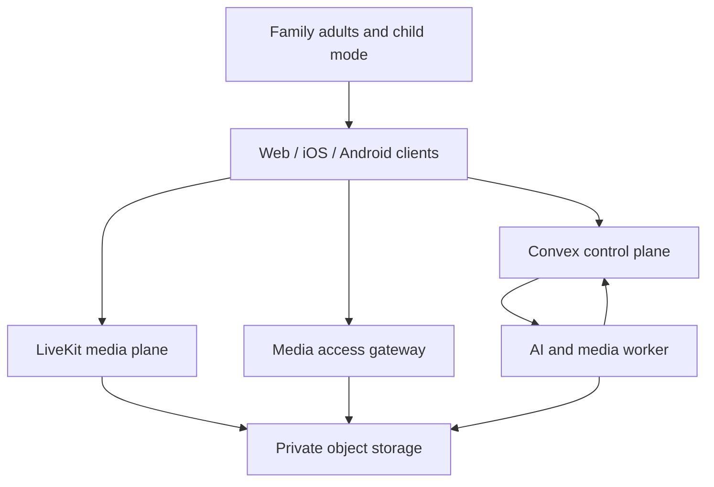
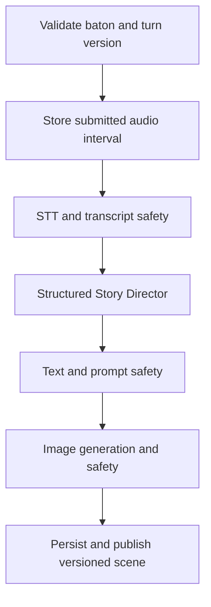

# StoryTime Architecture

| Field        | Value                                                        |
| ------------ | ------------------------------------------------------------ |
| Status       | Canonical implementation architecture                        |
| Version      | 1.0                                                          |
| Last updated | 2026-07-16                                                   |
| Applies to   | Web, iOS, Android, Convex, worker, media, AI, and operations |

This architecture implements the requirements in [../PRD.md](../PRD.md). If code and this document differ, the difference must be resolved explicitly; existing scaffolding does not silently override this design.

## 1. Architecture decisions

1. **One TypeScript monorepo.** Keep pnpm, Turborepo, TypeScript, Next.js, Expo/React Native, Convex, and the Node worker.
2. **Convex is the authoritative control plane.** It owns identity mappings, family authorization, consent state, call/chapter/turn state, ordered events, jobs, entitlements, audit metadata, and client subscriptions.
3. **LiveKit is the realtime media plane.** It transports the live call and produces separate participant track outputs. It is not the product database or source of chapter truth.
4. **Private object storage is the media plane.** Raw tracks, submitted turn audio, generated scenes, manifests, captions, thumbnails, and replay renditions live in private S3-compatible storage, with Cloudflare R2 as the production default and MinIO locally.
5. **Composition is asynchronous.** A containerized Node/FFmpeg worker builds replays from raw tracks and the ordered event ledger. LiveKit RoomComposite is not the default recording architecture.
6. **One worker service first.** AI and composition jobs have separate job kinds, concurrency, leases, and metrics but run in one deployable service for beta. Split only when load or isolation justifies it.
7. **No production Redis dependency by default.** Convex job tables and atomic claim mutations are the durable beta queue. Redis remains optional for local LiveKit or a future measured bottleneck.
8. **Clerk authenticates adults; it does not prove consent.** Consent is an independent versioned domain workflow.
9. **Server-authoritative state machines.** Clients render and request transitions; they do not decide baton, recording, consent, chapter, composition, deletion, or entitlement truth.
10. **Share contracts, not whole screens.** Web and native share domain types, Zod validators, state machines, provider contracts, prompts, analytics schemas, and design tokens. Each platform uses appropriate UI components.
11. **Production fails closed.** A production deployment cannot boot or issue a child/session token while any required provider is mock, missing, unsafe, or mis-scoped.
12. **Child-data provider controls are capabilities.** OpenAI Zero Data Retention approval, STT zero/minimum retention, and private/no-store image output are independently verified capabilities; `store: false` or a no-training promise alone is insufficient.
13. **Region is chosen before real data.** The launch jurisdiction and matching Convex, LiveKit, storage, worker, and processor regions are recorded before the production deployment receives family data.

## 2. System context



External providers are accessed behind adapters:

- Clerk: adult identity and sessions;
- LiveKit: rooms, media transport, webhook events, and track egress;
- Groq or selected provider: bounded-clip speech-to-text with approved retention settings;
- OpenAI or selected provider: structured Story Director and text moderation, enabled for under-13 personal data only after the provider's required Zero Data Retention approval;
- fal or selected provider: de-identified image generation with no-store/private output copied immediately into StoryTime storage;
- selected image-safety provider or approved deterministic fallback;
- Expo/APNs/FCM: device notifications;
- RevenueCat and Stripe: optional commercial entitlements;
- PostHog and Sentry: privacy-safe product analytics and operational telemetry.

Provider selection is configuration. Domain code cannot import a vendor SDK outside its adapter boundary.

## 3. Repository target

The current structure is retained and evolved:

```text
apps/
  web/                    Next.js public site, adult app, browser call, BFF routes
  mobile/                 Expo Router app for iOS and Android
  worker/                 Durable AI, media, deletion, and reconciliation jobs
convex/
  schema.ts               Authoritative persisted model
  auth.config.ts          Clerk/Convex identity trust
  families.ts             Family and membership operations
  profiles.ts             Child profile operations
  consent.ts              Consent lifecycle
  calls.ts                Call session transitions
  chapters.ts             Chapter lifecycle
  turns.ts                Baton and turn lifecycle
  media.ts                Recording and asset metadata
  jobs.ts                 Claim/lease/complete/retry mutations
  deletion.ts             Deletion orchestration
  entitlements.ts         Credits, plans, and storage
  webhooks.ts             Verified, idempotent event ingestion
packages/
  config/                 Typed environment and capability matrix
  prompts/                Versioned prompts and fallback catalogue
  types/                  Domain, event, API, and provider types
  validators/             Zod schemas, state machines, authorization policy
  ui-tokens/              Semantic design tokens
  test-fixtures/          Synthetic families, media, provider fixtures
infra/
  docker-compose.yml      Local LiveKit and MinIO; optional Redis
  livekit/                Local configuration
  scripts/                Setup, environment, seed, and verification scripts
docs/                     Canonical product and delivery documents
```

Do not perform a cosmetic directory migration before the walking vertical slice. Add modules incrementally and move shared code only when tests preserve behaviour.

## 4. Deployment topology

### 4.1 Production beta

| Component        | Target                                                                                  | Notes                                                            |
| ---------------- | --------------------------------------------------------------------------------------- | ---------------------------------------------------------------- |
| Public/adult web | Vercel                                                                                  | Next.js; preview and production environments separated           |
| Mobile           | Expo EAS + App Store Connect + Play Console                                             | Development, preview, and production profiles                    |
| Control plane    | Convex Cloud                                                                            | Separate dev/preview/prod deployments                            |
| Realtime media   | LiveKit Cloud or approved managed deployment                                            | Separate keys/projects by environment                            |
| Private media    | Cloudflare R2                                                                           | Separate private buckets by environment and data class           |
| Media gateway    | Cloudflare Worker or equivalent authorization proxy                                     | No origin URL in clients; checks each manifest/range/segment     |
| Worker           | Candidate long-running container runtime; Hetzner only if Phase 0 inventory confirms it | Node 22, FFmpeg, outbound access, health/metrics, rolling deploy |
| Analytics        | PostHog                                                                                 | Identifiers and enumerated metadata only                         |
| Errors/traces    | Sentry                                                                                  | Aggressive content redaction                                     |

The worker must not run as a Vercel request or edge function. Composition duration, FFmpeg, track downloads, retries, and local scratch space require a long-running container.

### 4.2 Environment isolation

`dev`, `preview`, and `production` each use distinct:

- Clerk instance/keys and redirect allow-list;
- Convex deployment and auth issuer configuration;
- LiveKit project/keys and webhook secret;
- R2 bucket namespace and service credentials;
- AI provider keys and usage budgets;
- push credentials and app identifiers;
- billing products/webhook secrets;
- PostHog project and Sentry environment;
- signing keys, secrets, and retention configuration.

Synthetic test data is mandatory outside approved beta production. Production data must never be copied into development.

## 5. Client architecture

### 5.1 Shared client rules

- Subscribe to authoritative Convex records and ordered chapter events.
- Issue intent commands containing expected state/version and idempotency key.
- Discard stale or duplicate responses and events.
- Never embed provider secrets or trust local roles/entitlements.
- Cache only the minimum necessary private data; clear protected caches on sign-out, revocation, child-mode exit, and deletion.
- Treat internal worker/provider operation URLs and playback-session tokens as bearer credentials; do not persist or log them.
- Use one normalized connection-state model across LiveKit web/native adapters.

### 5.2 Web

Next.js App Router owns:

- public marketing, trust, legal, pricing, and support pages;
- Clerk-protected adult application routes;
- responsive family/profile/consent/vault/settings surfaces;
- LiveKit web participation;
- narrowly scoped BFF routes for LiveKit token issue, playback-session issue, billing webhooks/checkout, and provider callbacks where Convex HTTP actions are not appropriate.

Every BFF route:

1. authenticates the current adult or verifies the external webhook;
2. validates input with the shared schema;
3. performs server-side family authorization;
4. uses idempotency and rate limits;
5. returns a stable typed error code without sensitive detail.

State-changing browser requests use same-site cookies, origin checks, and CSRF protection where the framework/session model requires it.

### 5.3 Mobile

Expo Router, Expo prebuild/CNG, and development builds are the default. Native modules include LiveKit, secure storage, notifications, local authentication, media permissions, and platform call delivery as required.

LiveKit contains native code and does not run in Expo Go. Use `expo-dev-client`, generated native projects, and physical-device EAS development builds from the first media spike. The repository currently targets Expo SDK 53; an upgrade to the then-current supported Expo/React Native/LiveKit matrix is a measured Phase 0 decision, not an untested bulk update. If upgrading to a release that requires React Native's New Architecture, prove both platforms before merging.

Escalate to focused Swift/Kotlin modules or bare workflow only after an evidence-backed spike shows prebuild cannot meet:

- iOS CallKit/VoIP policy and incoming-call behaviour;
- Android call notification/full-screen intent policy;
- background/reconnect behaviour;
- LiveKit track publication/egress reliability;
- secure key/device handling.

Mobile navigation has explicit adult and child-safe route groups. Exiting child mode or opening adult-only routes requires recent adult authentication.

## 6. Identity, family authorization, and consent

### 6.1 Identity binding

Clerk `subject` is mapped to an internal adult `user`. Convex functions resolve the current identity from trusted auth context; caller-provided user IDs are not identity proof.

Webhook/user synchronisation is idempotent and preserves disabled/deleted status. Account deletion does not orphan family ownership; ownership transfer or family deletion must resolve first.

### 6.2 Authorization model

Authorization is evaluated by a single policy module with:

- current adult;
- requested family/profile/chapter;
- active membership/access grant;
- role capability;
- recent-auth requirement;
- consent state;
- resource state;
- entitlement where applicable.

Queries filter at the database boundary. An unauthorized record is not fetched and then hidden only in UI.

### 6.3 Consent boundary

Consent and session recording acceptance are separate:

- `consentGrant`: guardian-to-child, versioned and potentially expiring;
- `recordingAcceptance`: each adult-to-chapter, per session;
- `handoffConfirmation`: nearby adult confirms the child may enter child mode;
- `recordingAuthority`: server-derived boolean that permits capture and child media publication.

The adult lobby is unrecorded and explicitly adult-only. The nearby supervisor and remote adult join under adult participant identities and may publish adult lobby media for identity confirmation; no egress or AI processing is active. On committed handoff, the nearby-supervisor participant unpublishes and leaves. The device then obtains a distinct, short-lived child-mode participant identity with only the required grants. This sequential identity boundary prevents lobby tracks from being relabelled or captured as chapter tracks; a client UI flag cannot confer recording authority.

## 7. LiveKit design

### 7.1 Room and participant model

- One LiveKit room per call session/chapter attempt.
- Opaque room name; no child or family name in room identifiers.
- Participant identity is an opaque internal participant ID.
- The child-side device uses sequential participant identities: nearby supervisor in the adult lobby, then child mode after handoff. Tracks never change owner/role in place.
- Metadata contains only enumerated role/session data needed by clients.
- Tokens expire quickly and require server-authorized refresh.
- Grants restrict room, publish/subscribe, data, and administrative actions by role.

A transport participant is not automatically a story actor:

```ts
type TransportParticipantRole = "REMOTE_ADULT" | "NEARBY_SUPERVISOR" | "CHILD_MODE";
type StoryActorRole = "ADULT" | "CHILD";

type ParticipantBinding = {
  transportParticipantId: string;
  logicalActorId?: string; // absent for supervisor-only lobby participation
  transportRole: TransportParticipantRole;
  storyRole?: StoryActorRole;
  validFromSequence: number;
  validUntilSequence?: number;
};
```

The nearby supervisor binding ends at handoff; a new child-mode transport identity binds to the child story actor. No track or turn changes actor in place.

### 7.2 Media behaviour

- Use adaptive stream and dynacast where supported.
- Prioritise audio under constrained bandwidth.
- Track network quality and reconnect state.
- Keep live human audio available while the story provider processes only submitted turn audio.
- Capture recording-relative time from a server-authoritative timebase and correlate LiveKit track events with ledger sequence.

### 7.3 Egress

- Do not configure room-level Auto Egress for the pre-authority lobby. Start Track Egress only after recording authority and after each authorized track is published.
- Target four logical streams during the recorded chapter: remote-adult audio, remote-adult video, child audio, and child video.
- Egress writes directly to the private environment bucket when supported.
- Track Egress output is pass-through and may be MP4, WebM, or Ogg depending on the published codec; the media worker normalizes segments before composition.
- Reconnect or device changes can publish a new track ID. Start replacement egress idempotently and append it to the same participant/kind segment manifest instead of overwriting history.
- Store provider egress/track IDs, participant/kind, segment index, codec/container, timebase, start/stop, object key, checksum, status, and webhook version.
- Verify all webhooks and deduplicate by provider event ID.
- A missing/stuck track moves recording into a recoverable state; it must not mark the chapter ready.

The prototype “ghost recorder” is a replay layout specification only.

## 8. AI orchestration

### 8.1 Turn pipeline



Each step writes a durable attempt record before external work and an idempotent result after it. Retries reuse the same logical turn and never create a second displayed scene.

### 8.2 Structured output

The canonical output contract is:

```ts
type StoryDirectorOutput = {
  storyBeat: string;
  childSafeCaption: string;
  imagePrompt: string;
  nextTurnPrompt: string;
  continuitySummary: string;
  safetyDisposition: "allowed" | "replaced";
};
```

All strings have length limits and age-band rules. Unknown fields are rejected. Schema repair is attempted once with bounded input; otherwise the approved fallback is used.

### 8.3 Safety gateway

Safety checks:

- profile/display/custom seed input;
- submitted transcript;
- Story Director beat, caption, next prompt, image prompt, and continuity summary;
- generated image before child publication.

The gateway derives the authoritative allow/replace/block decision. The model's `safetyDisposition` field is logged only as untrusted structured output and can never bypass policy evaluation. Continuity summaries are de-identified before persistence or reuse.

Safety events store category, rule/policy version, action, severity, provider/model, and redacted reason. Raw blocked content is not placed in general logs or analytics.

The fallback catalogue is versioned, pre-reviewed, age-banded, non-frightening, and sufficient to pass or end a turn without external AI.

### 8.4 Provider resilience

- hard timeouts per provider and total turn budget;
- bounded exponential retry only for safe retryable failures;
- circuit breaker and health/capability flags;
- no silent live-to-mock fallback in production;
- usage/cost entry for every attempt, including failed attempts;
- provider responses validated before persistence/publication.

### 8.5 Provider data controls

The provider capability registry is checked at startup, before token issuance, and before every real provider job:

- OpenAI child-personal-data processing remains disabled until approved Zero Data Retention is active for the project. Requests also set the provider's non-storage option, but that flag is not treated as ZDR approval.
- Groq STT receives a closed baton clip, not the open call. Enable its Zero Data Retention setting, avoid persistent provider file URLs, and account for its documented minimum billable duration in cost tests.
- fal requests are server-side and de-identified, disable request I/O storage, request private/hidden media access, preserve model safety checking, and copy approved output immediately to private R2. Provider URLs never reach clients.
- A contract/configuration verification record stores provider, account/project, region, control state, verifier, date, and expiry without storing a secret.

Current vendor constraints must be rechecked against primary documentation before production enablement: [OpenAI under-18 guidance](https://developers.openai.com/api/docs/guides/safety-checks/under-18-api-guidance), [OpenAI data controls](https://developers.openai.com/api/docs/guides/your-data), [Groq data controls](https://console.groq.com/docs/your-data), and [fal media retention and access](https://fal.ai/docs/documentation/model-apis/media-expiration).

## 9. Recording ledger and time model

Every retained event includes:

```ts
type TimelineEventType =
  | "SESSION_CREATED"
  | "CONSENT_VALIDATED"
  | "CHILD_HANDOFF_VERIFIED"
  | "ROOM_CONNECTED"
  | "RECORDING_BOUNDARY_SHOWN"
  | "RECORDING_STARTED"
  | "STORY_SETUP_OPENED"
  | "STORY_SEED_LOCKED"
  | "TURN_STARTED"
  | "TURN_SUBMITTED"
  | "TRANSCRIPT_READY"
  | "TRANSCRIPT_FAILED"
  | "STORY_BEAT_READY"
  | "STORY_BEAT_FALLBACK"
  | "IMAGE_PROMPT_READY"
  | "IMAGE_READY"
  | "IMAGE_FALLBACK"
  | "BATON_PASSED"
  | "CHECKPOINT_SHOWN"
  | "NETWORK_MODE_CHANGED"
  | "ENDING_STARTED"
  | "RECORDING_STOPPED"
  | "RAW_TRACKS_STORED"
  | "LEDGER_FINALIZED"
  | "COMPOSITION_QUEUED"
  | "COMPOSITION_STARTED"
  | "REPLAY_READY"
  | "REPLAY_FAILED";

type TimelineEvent<TType extends TimelineEventType = TimelineEventType> = {
  eventId: string;
  chapterId: string;
  sessionId: string;
  sequence: number;
  schemaVersion: number;
  eventType: TType;
  actorId?: string;
  actorRole?: "ADULT" | "CHILD" | "SYSTEM";
  transportParticipantId?: string;
  recordingTimeMs: number;
  occurredAt: number;
  sourceOccurredAt?: number;
  measuredClientOffsetMs?: number;
  correlationId?: string;
  turnId?: string;
  assetId?: string;
  providerJobId?: string;
  idempotencyKey: string;
  payload: TimelinePayloadByType[TType];
};
```

`TimelinePayloadByType` is a shared, versioned map of strict schemas; unknown event names or fields are rejected. Adding an event requires schema, migration/compatibility behavior, compositor handling, and tests.

Rules:

- `sequence` is allocated atomically by the server per chapter.
- `recordingTimeMs` is non-negative and tied to the chapter recording boundary.
- late provider/webhook events receive the next sequence but retain provider/source timestamps in a validated payload.
- events are append-only while the chapter exists; corrections use compensating events.
- deleting the chapter removes the content ledger.
- analytics events are separate and content-free.

## 10. Composition architecture

### 10.1 Manifest

The deterministic manifest contains:

- chapter/render-template/manifest version;
- output size, frame rate, codec, audio, caption, and layout settings;
- recording boundary and target duration;
- ordered participant track segments with timebase/offset;
- approved scene assets and display intervals;
- approved captions and speaker labels;
- network/recording/fallback markers;
- object checksums;
- expected output keys.

The manifest is immutable per composition attempt. A new render creates a new manifest version.

### 10.2 Queue and claims

Convex `jobs` is the single durable typed queue. A `COMPOSE_REPLAY` job references an immutable `compositionAttempt`/manifest; notification, AI, export, deletion, retention, entitlement, and reconciliation jobs use the same envelope with kind-specific strict payloads:

- atomic claim with worker ID, lease expiry, attempt, and idempotency;
- heartbeat renews the lease;
- expired leases become retryable;
- max attempts route to recoverable/dead-letter state;
- cancellation is checked before external download and before upload/publication;
- output publication uses a deterministic key and compare-and-set state transition.

### 10.3 Worker execution

1. Claim.
2. Fetch manifest and authorize service access.
3. Download/verify required private inputs to isolated scratch.
4. Compose with a version-pinned FFmpeg command/template.
5. Probe output and validate duration, streams, loudness, sync markers, and decode.
6. Upload to a private temporary key and checksum.
7. Copy/write to the deterministic immutable final key using create-if-absent semantics. If it already exists, require the expected checksum/size or fail with a collision alert.
8. `HEAD`/read the final object and verify checksum, size, content type, private policy, and decodability from the final key.
9. Compare-and-set asset, job, and chapter metadata to `READY` referencing that verified final object.
10. Delete the temporary object and remove local scratch in success and failure paths.

R2/S3 copy plus delete is not an atomic rename. Metadata must never become `READY` before the immutable final object is materialized and verified. An orphan final object is reconcilable; a `READY` record pointing to a missing or unverified object is forbidden.

Beta output defaults:

- 1280×720 landscape;
- H.264 video and AAC audio in MP4;
- 30 fps;
- loudness-normalized mixed audio while retaining separate raw tracks during the recovery window;
- embedded/visible captions plus a WebVTT sidecar;
- private gateway delivery.

## 11. Data model

The existing Convex schema is a useful scaffold but is not complete. In particular, generic string statuses, absent family/trusted-device entities, missing idempotency/version fields, and conflated session/chapter/recording state must be corrected with migrations and tests.

Convex stores metadata and bounded state only; documents must remain well below its 1 MiB document limit. Choose the production Convex region before real data because moving an existing deployment requires a new deployment and migration rather than an in-place region switch.

| Entity                  | Required responsibility                                                             |
| ----------------------- | ----------------------------------------------------------------------------------- |
| `users`                 | Adult identity mapping, locale, status, timestamps                                  |
| `families`              | Tenant boundary, owner, region/configuration, status                                |
| `familyMembers`         | Adult role, trust/invitation state, revocation                                      |
| `provisionalChildSlots` | Expiring minimal consent-first eligibility record; no name/media                    |
| `childProfiles`         | Adult-controlled display data, age band, preferences, status                        |
| `invitations`           | Hashed token, role, recipient, expiry, single-use state                             |
| `consentGrants`         | Child/guardian scopes, evidence, versions, lifecycle                                |
| `recordingAcceptances`  | Adult/chapter notice acceptance                                                     |
| `trustedDevices`        | Adult/device platform, push token reference, last seen, revoked                     |
| `adventures`            | Lightweight continuity/title container                                              |
| `chapters`              | Atomic product unit and chapter lifecycle                                           |
| `callSessions`          | Room/call delivery and handoff lifecycle                                            |
| `participants`          | Transport identity, role, device, join/leave/reconnect                              |
| `participantBindings`   | Versioned transport-participant to logical story-actor binding                      |
| `storySeeds`            | Five selected inputs and immutable locked version                                   |
| `batonState`            | Holder, version, expiry, atomic transition                                          |
| `turns`                 | Speaker, audio interval, lifecycle, expected version                                |
| `storyArtifacts`        | Approved transcript/beat/caption/prompt/continuity versions                         |
| `safetyEvents`          | Redacted decision metadata and fallback                                             |
| `assets`                | Private object metadata, ownership, checksum, retention/status                      |
| `mediaTracks`           | LiveKit track/egress and timing metadata                                            |
| `timelineEvents`        | Ordered composition ledger                                                          |
| `jobs`                  | Generic typed queue envelope, priority, lease, retry, cancellation, parent/resource |
| `compositionAttempts`   | Immutable render manifest reference, worker version, output and verification state  |
| `replayAssets`          | Verified private renditions and captions                                            |
| `playbackSessions`      | Short-lived audience/resource/device binding and revocation state                   |
| `usageEvents`           | Provider/model/unit/cost version per attempt/chapter                                |
| `entitlements`          | Canonical plan, credit, storage, export, retention capabilities                     |
| `deletionJobs`          | Scoped purge and per-processor state                                                |
| `auditEvents`           | Content-free high-risk action evidence                                              |

All protected tables require family/resource indexes that support authorization without full-table scans.

## 12. Job kinds

The worker supports typed jobs:

- `TURN_STT`
- `TURN_DIRECT`
- `TURN_IMAGE`
- `TURN_PUBLISH`
- `SEND_NOTIFICATION`
- `RECORDING_FINALIZE`
- `COMPOSE_REPLAY`
- `VERIFY_REPLAY`
- `PRIVACY_EXPORT`
- `MEDIA_EXPORT`
- `DELETE_SCOPE`
- `DELETE_PROCESSOR`
- `APPLY_ENTITLEMENT_EVENT`
- `RECONCILE_STORAGE`
- `RECONCILE_PROVIDER_USAGE`
- `RECONCILE_ENTITLEMENTS`
- `PURGE_EXPIRED_RAW_MEDIA`
- `RETRY_WEBHOOK`

Each job has:

- logical resource and idempotency key;
- payload schema/version;
- priority and not-before time;
- status, attempt, maximum attempts;
- claim owner, lease, heartbeat;
- redacted error code/detail;
- created/started/completed timestamps;
- cancellation and parent job where relevant.

## 13. API and event contracts

### 13.1 Command pattern

State-changing commands accept:

```ts
type Command<T> = {
  requestId: string;
  expectedVersion: number;
  payload: T;
};
```

Responses use stable codes:

```ts
type Result<T> =
  | { ok: true; value: T; version: number }
  | {
      ok: false;
      code:
        | "UNAUTHENTICATED"
        | "UNAUTHORIZED"
        | "RECENT_AUTH_REQUIRED"
        | "CONSENT_REQUIRED"
        | "INVALID_STATE"
        | "STALE_VERSION"
        | "ALREADY_COMPLETED"
        | "RATE_LIMITED"
        | "CAPABILITY_UNAVAILABLE"
        | "RESOURCE_QUARANTINED"
        | "NOT_FOUND"
        | "RETRYABLE_PROVIDER_FAILURE"
        | "INTERNAL_FAILURE";
      recoverable: boolean;
      retryAfterMs?: number;
    };
```

Do not send sensitive internal error messages to clients.

### 13.2 Critical external events

Webhook handlers must verify signature, timestamp/replay window, environment, and provider event ID before mutation:

- Clerk user/session changes;
- LiveKit room/participant/track/egress changes;
- consent provider result/withdrawal;
- RevenueCat entitlement events;
- Stripe checkout/subscription/refund events;
- storage completion where used.

Store the normalized event ID and processing state so retries cannot duplicate domain effects.

## 14. Private media access

Clients never receive bucket credentials or an R2/origin-presigned URL. The media gateway:

1. authenticates the adult or validates a short-lived, audience/resource/device-bound playback session;
2. checks active family/profile/chapter access, resource state, and child-mode replay permission;
3. checks revocation/quarantine on every manifest, MP4 range, caption, thumbnail, or future HLS segment request;
4. fetches the exact private object/range from R2 with a gateway-only service identity;
5. applies private/no-store response controls and emits a content-free access metric;
6. expires playback sessions in ≤5 minutes and refuses refresh immediately after revocation.

Quarantine therefore denies new sessions and unfetched bytes immediately. Bytes already delivered into an authorized device or operating-system buffer cannot be recalled; the product must not promise otherwise. Explicit authorized export is a separately audited capability.

Buckets deny public access, listing, unencrypted transport, and cross-environment identities. Worker/provider upload URLs are separate, never client-visible, and as short-lived as the operation permits.

## 15. Observability

Every request/job carries `requestId`, `chapterId` where applicable, `jobId`, environment, build SHA, and provider attempt ID. Do not use names/emails as correlation IDs.

Required dashboards:

- call creation, notification, join, reconnect, and end;
- consent and authorization rejection;
- turn stage latency, timeout, fallback, and cost;
- egress/track finalization;
- composition queue depth, age, attempt, success, and duration;
- signed-media failures;
- deletion age/partial failure;
- storage and per-chapter economics;
- client crashes by release/platform.

Required alerts:

- production mock/unsafe capability;
- child/recording transition invariant violation;
- elevated auth/signature failure;
- recording or composition failure threshold;
- deletion nearing SLA;
- provider cost/budget anomaly;
- private bucket/public-policy drift;
- crash-free session regression.

## 16. Security boundaries

| Boundary                       | Trust rule                                                     |
| ------------------------------ | -------------------------------------------------------------- |
| Client → Convex/BFF            | Untrusted input; authenticate, validate, authorize, rate-limit |
| Provider webhook → backend     | Verify signature/replay protection; idempotent normalize       |
| Worker → Convex/storage        | Dedicated least-privilege service identity                     |
| Client → LiveKit               | Short-lived scoped token; server decides grants                |
| Client → media                 | Per-resource signed read only                                  |
| AI provider response → product | Untrusted; schema and safety validate                          |
| Logs/analytics                 | Content-free by default; redact before transport               |

Standard WebRTC transport encryption is the beta baseline. Do not market or document cloud-recorded sessions as end-to-end encrypted unless a LiveKit E2EE spike proves an authorized key path that lets the recording service decode only after consent. Opaque E2EE media and server-side egress are otherwise in tension.

See [security-privacy.md](security-privacy.md) for the full data map and controls.

## 17. Architecture acceptance

Architecture is implemented only when:

- one chapter uses the authoritative state machines end-to-end;
- web, iOS, and Android consume the same domain contracts;
- production configuration cannot use mock identity, consent, AI, storage, or recording;
- LiveKit tokens and media-gateway playback sessions are authorization-tested;
- the lobby publishes no child media, and provider capability checks prove required zero-retention/private-output controls;
- separate raw tracks plus ordered ledger produce a verified private replay;
- retries do not duplicate turns, credits, jobs, recordings, assets, or chapters;
- a recoverable failure can resume after client and worker restart;
- deletion removes the chapter and all media/derivatives while preserving only content-free evidence;
- per-chapter cost reconciles across providers;
- the release gates in [acceptance-test-plan.md](acceptance-test-plan.md) pass.
