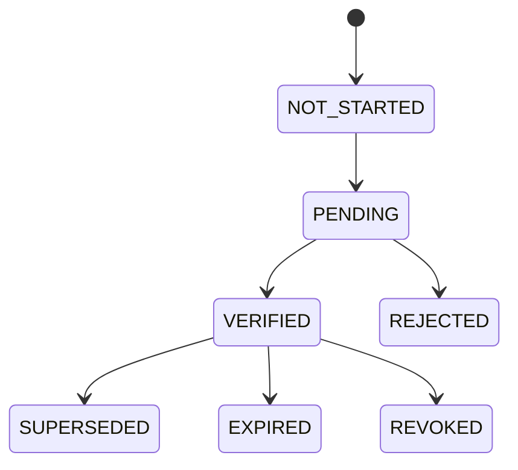
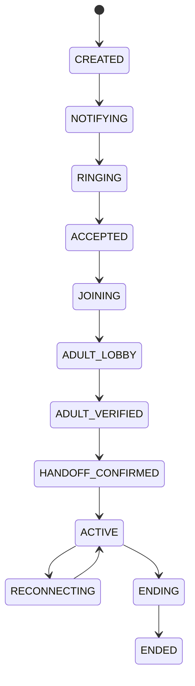
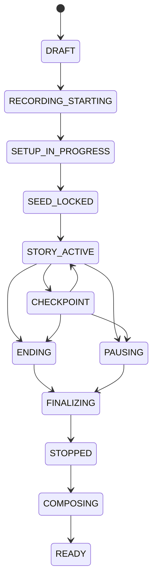
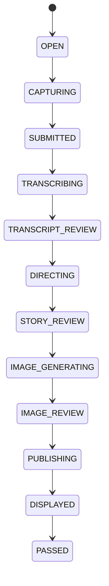
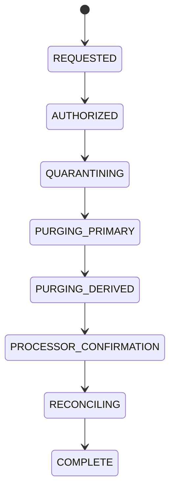

# StoryTime Canonical State Machines

| Field        | Value      |
| ------------ | ---------- |
| Status       | Normative  |
| Version      | 1.0        |
| Last updated | 2026-07-16 |

These state machines are shared by Convex, web, mobile, worker, tests, analytics, and operational tooling. UI labels may be friendlier, but persisted states and transitions must use these semantics.

The current repository's generic string statuses and earlier `sessionLifecycle.ts` graph are scaffolding. They must be migrated rather than extended ad hoc.

## 1. Universal transition rules

Every state-changing command includes:

- authenticated actor or trusted service identity;
- resource ID and current version;
- expected state/version;
- globally unique request/idempotency key;
- validated payload version;
- server timestamp;
- authorization, consent, entitlement, and resource precondition checks.

Every accepted transition:

1. compares expected state/version atomically;
2. applies at most once for an idempotency key;
3. increments resource version;
4. emits one normalized domain/timeline event;
5. writes content-free audit metadata for high-risk actions;
6. returns the new state/version.

Rejected stale, duplicate, unauthorized, or invalid commands do not partially mutate credits, assets, jobs, recording, or baton.

Terminal state does not mean undeletable. Retained resources may enter their deletion state machine.

### 1.1 Cross-machine precedence

| High-priority event      | Call                                             | Chapter                                                           | Recording                                           | Turn/AI/jobs                                                                    |
| ------------------------ | ------------------------------------------------ | ----------------------------------------------------------------- | --------------------------------------------------- | ------------------------------------------------------------------------------- |
| Consent/access invalid   | Lobby ends or active call enters `ENDING`        | Pre-recording draft cancels; recorded chapter enters `FINALIZING` | `ANNOUNCING/STARTING/RECORDING/DEGRADED → STOPPING` | New turns blocked; in-flight output cancelled/quarantined; late results ignored |
| Authorized deletion      | Token/playback refresh denied; related call ends | Any retained state enters `DELETING`                              | Stop/finalize only as needed to enumerate and purge | Deletion cancels AI, composition, export, retention, and derivative creation    |
| Participant network loss | `ACTIVE → RECONNECTING`                          | Remains active within grace, then `PAUSING/FINALIZING`            | `RECORDING → DEGRADED`; segments/gap recorded       | Open turn seals/cancels per policy; stale result cannot publish                 |
| Hard end                 | `ACTIVE/RECONNECTING → ENDING`                   | `STORY_ACTIVE/CHECKPOINT → ENDING → FINALIZING`                   | `RECORDING/DEGRADED → STOPPING`                     | No new turn; bounded ending job only if already authorized                      |

Deletion and authority loss outrank all lower-priority client, provider, billing, and retry events. Expected versions and terminal checks make late events no-ops with content-free audit metadata.

## 2. Consent grant



| State         | Meaning                                                 |
| ------------- | ------------------------------------------------------- |
| `NOT_STARTED` | No provider/evidence workflow has begun                 |
| `PENDING`     | Evidence workflow exists but is not sufficient          |
| `VERIFIED`    | Current scopes and notice versions are valid            |
| `REJECTED`    | Provider or review rejected the evidence                |
| `EXPIRED`     | Time-limited grant ended                                |
| `REVOKED`     | Guardian withdrew the grant                             |
| `SUPERSEDED`  | A material policy/scope/version change requires renewal |

Only `VERIFIED` can contribute to recording authority.

Production never treats `mock` evidence as `VERIFIED`. A transition away from `VERIFIED` immediately blocks new child sessions and invalidates pending room/recording authority. If a related call is in an adult lobby it ends without recording. If a chapter is recording, it triggers the high-priority authority-loss transition below. Renewing consent creates a new versioned evidence attempt; it never mutates a revoked, expired, or superseded record back to `PENDING`.

| From          | Command/event                       | To           | Effect                                                     |
| ------------- | ----------------------------------- | ------------ | ---------------------------------------------------------- |
| `NOT_STARTED` | begin evidence attempt              | `PENDING`    | New version/evidence reference and expiry                  |
| `PENDING`     | provider verifies                   | `VERIFIED`   | Method/scopes/notices and evidence reference committed     |
| `PENDING`     | provider rejects or attempt expires | `REJECTED`   | Terminal attempt; safe reason code only                    |
| `VERIFIED`    | policy/scope version changes        | `SUPERSEDED` | Authority-loss cascade; renewal creates a successor record |
| `VERIFIED`    | grant reaches expiry                | `EXPIRED`    | Authority-loss cascade; renewal creates a successor record |
| `VERIFIED`    | guardian withdraws                  | `REVOKED`    | Authority-loss and configured deletion/retention cascade   |

`REJECTED`, `SUPERSEDED`, `EXPIRED`, and `REVOKED` are terminal for that consent record. Retry or renewal creates a linked successor with a new version and evidence attempt.

## 3. Invitation

| From       | Command/event         | To         | Preconditions/effect                                                        |
| ---------- | --------------------- | ---------- | --------------------------------------------------------------------------- |
| `CREATED`  | send                  | `SENT`     | Recipient, role, family/profile scope, token hash, expiry set               |
| `SENT`     | accept                | `ACCEPTED` | Authenticated recipient matches; token unused/unexpired; grant created once |
| `SENT`     | decline               | `DECLINED` | Recipient authenticated                                                     |
| `SENT`     | revoke                | `REVOKED`  | Authorized owner/guardian                                                   |
| `SENT`     | expiry reconciliation | `EXPIRED`  | Server time ≥ expiry                                                        |
| `ACCEPTED` | membership revoke     | `REVOKED`  | Grant revoked; active access/token refresh denied                           |

`ACCEPTED`, `DECLINED`, `REVOKED`, and `EXPIRED` are terminal for that invitation. Resend creates a new invitation and token.

## 4. Call session

The call controls notification, adult lobby, handoff, and realtime participation. It is related to but not the same as chapter, recording, or composition state.



Terminal alternatives from the applicable nonterminal states: `DECLINED`, `MISSED`, `CANCELLED`, `EXPIRED`, and `FAILED`.

| Terminal event                                                 | Valid source states                                          | Terminal/result                                                    |
| -------------------------------------------------------------- | ------------------------------------------------------------ | ------------------------------------------------------------------ |
| Recipient declines                                             | `RINGING`                                                    | `DECLINED`; cancel other notifications                             |
| Ring deadline passes                                           | `NOTIFYING`, `RINGING`                                       | `MISSED` when ringing occurred, otherwise `EXPIRED`                |
| Caller cancels before active handoff                           | `CREATED` through `HANDOFF_CONFIRMED` except terminal states | `CANCELLED`; revoke notifications/tokens; no recording             |
| Pre-active infrastructure/permission failure exhausts recovery | `CREATED` through `HANDOFF_CONFIRMED`                        | `FAILED`; no retained chapter unless capture actually began        |
| Active unrecoverable failure or authority loss                 | `ACTIVE`, `RECONNECTING`                                     | `ENDING → ENDED`; finalize/degrade the recorded chapter truthfully |

| State               | Required invariant                                                                           |
| ------------------- | -------------------------------------------------------------------------------------------- |
| `CREATED`           | Access, consent eligibility, entitlement, and conflicting-session checks passed              |
| `NOTIFYING`         | Expiring notification/deep link exists                                                       |
| `RINGING`           | At least one target device has a valid pending call                                          |
| `ACCEPTED`          | Exactly one accepting device has atomically claimed the call                                 |
| `JOINING`           | Scoped LiveKit tokens may be issued for adult lobby only                                     |
| `ADULT_LOBBY`       | Adult identities only; recording/AI off; adults verify caller; no child participant or grant |
| `ADULT_VERIFIED`    | Nearby adult recently authenticated and remote adult identity/access confirmed               |
| `HANDOFF_CONFIRMED` | Acceptances/consent valid; supervisor tracks stop; distinct child identity may be issued     |
| `ACTIVE`            | Child mode/room active; related chapter controls story lifecycle                             |
| `RECONNECTING`      | Grace window active; authoritative state retained; no duplicate room/session                 |
| `ENDING`            | New joins/turns blocked; participant/room shutdown in progress                               |
| `ENDED`             | Participants/room closed and final timestamps persisted                                      |

| From                                           | Trigger                                    | To                  | Notes                                                     |
| ---------------------------------------------- | ------------------------------------------ | ------------------- | --------------------------------------------------------- |
| `CREATED`                                      | notification job claimed                   | `NOTIFYING`         | Idempotent notification key                               |
| `NOTIFYING`                                    | provider accepted ≥1 delivery              | `RINGING`           | Delivery failure may retry or fail                        |
| `RINGING`                                      | adult accepts                              | `ACCEPTED`          | First valid claim wins                                    |
| `RINGING`                                      | adult declines                             | `DECLINED`          | Cancel other notifications                                |
| `RINGING`                                      | expiry                                     | `MISSED`            | No late accept                                            |
| `ACCEPTED`                                     | token/join begins                          | `JOINING`           | Room-scoped adult grant                                   |
| `JOINING`                                      | both adult identities joined               | `ADULT_LOBBY`       | Adult media may publish; recording/AI remain off          |
| `ADULT_LOBBY`                                  | local auth + trusted caller confirm        | `ADULT_VERIFIED`    | Biometrics verify local guardian only                     |
| `ADULT_VERIFIED`                               | consent/notice/handoff command             | `HANDOFF_CONFIRMED` | All gates re-evaluated atomically                         |
| `HANDOFF_CONFIRMED`                            | supervisor leaves; child mode joins        | `ACTIVE`            | Distinct child grant; recording starts before setup       |
| `ACTIVE`                                       | transient connection loss                  | `RECONNECTING`      | Default grace ≤60s                                        |
| `RECONNECTING`                                 | authorized participant resumes             | `ACTIVE`            | Same participant/session identity                         |
| `RECONNECTING`                                 | grace expires                              | `ENDING`            | Chapter becomes paused/recovering as appropriate          |
| `ACTIVE`                                       | chapter ends or unrecoverable call failure | `ENDING`            | Stop exactly once                                         |
| `ADULT_LOBBY/ADULT_VERIFIED/HANDOFF_CONFIRMED` | consent/access becomes invalid             | `ENDING`            | Revoke refresh; remove participants; no recording/AI      |
| `ACTIVE/RECONNECTING`                          | consent/access becomes invalid             | `ENDING`            | Block turns/AI publication; revoke tokens; stop recording |
| `ENDING`                                       | room/participant finalization              | `ENDED`             | Does not imply replay ready                               |

## 5. Chapter

The chapter is StoryTime's atomic product unit.



Recovery/terminal states: `CANCELLED`, `RECOVERING`, `COMPOSITION_FAILED`, `FAILED_TERMINAL`, `DELETING`, `DELETED`.

| State                | Meaning                                                                              |
| -------------------- | ------------------------------------------------------------------------------------ |
| `DRAFT`              | Chapter and call intent exist; no setup/recording                                    |
| `RECORDING_STARTING` | Handoff/recording authority committed; child identity and egress are being confirmed |
| `SETUP_IN_PROGRESS`  | Recording is visible; five choices are being made                                    |
| `SEED_LOCKED`        | Immutable seed/version exists                                                        |
| `STORY_ACTIVE`       | Turns and baton may advance                                                          |
| `CHECKPOINT`         | New child submissions paused; private adult choice required                          |
| `ENDING`             | One bounded ending turn/scene may be produced                                        |
| `PAUSING`            | No new story output; chapter will be resumable as a later chapter                    |
| `FINALIZING`         | Recording/ledger/assets are closing                                                  |
| `STOPPED`            | Inputs are durable enough to compose                                                 |
| `COMPOSING`          | At least one active/retryable composition job exists                                 |
| `READY`              | Verified private replay is published                                                 |
| `RECOVERING`         | Inputs/recording require automated or operator recovery before compose               |
| `COMPOSITION_FAILED` | Inputs retained; composition exhausted attempts and is retryable after intervention  |
| `CANCELLED`          | No retained/replayable chapter; only content-free audit may remain                   |
| `FAILED_TERMINAL`    | Chapter cannot be recovered; authorized adult is informed                            |
| `DELETING`           | Access quarantined; deletion job active                                              |
| `DELETED`            | Content and media purged; minimal audit only                                         |

Critical rules:

- `DRAFT → RECORDING_STARTING` requires `HANDOFF_CONFIRMED`, a distinct child participant identity, and fresh recording authority.
- `RECORDING_STARTING → SETUP_IN_PROGRESS` requires recording confirmation or an explicit product-approved degraded mode; silent recording failure is not allowed.
- `SETUP_IN_PROGRESS → SEED_LOCKED` requires all five validated categories exactly once.
- `SEED_LOCKED → STORY_ACTIVE` requires one immutable seed/version and allocation of the first baton.
- Authority loss from any recorded nonterminal state blocks new turns and provider publication, cancels or quarantines in-flight AI, revokes room refresh, drives recording to `STOPPING`, and sends the chapter to `FINALIZING`. An authorized deletion request instead quarantines access and enters `DELETING`; already-delivered bytes cannot be recalled.
- `STORY_ACTIVE/CHECKPOINT → PAUSING` produces a completed saved chapter, not an in-place resumption of the same recording. Continuing later creates the next chapter.
- `FINALIZING → STOPPED` requires an ordered ledger boundary and every expected segment marked `READY` or explicitly `ABSENT_DEGRADED` under the partial-replay policy. Any unresolved recoverable segment keeps the chapter in `RECOVERING`.
- `COMPOSING → READY` requires replay verification, not worker success alone.
- Deletion may begin from any retained state after authorization and cancels/invalidates outstanding work.

## 6. Baton

Baton is a versioned singleton per active chapter:

```ts
type BatonState = {
  chapterId: string;
  holderParticipantId: string;
  version: number;
  status: "OPEN" | "CAPTURING" | "PROCESSING" | "LOCKED";
  openedAt: number;
  expiresAt: number;
};
```

| From         | Trigger                 | To                 | Invariant                                 |
| ------------ | ----------------------- | ------------------ | ----------------------------------------- |
| `LOCKED`     | open next baton         | `OPEN`             | Chapter active; selected holder connected |
| `OPEN`       | holder starts           | `CAPTURING`        | Expected baton version                    |
| `CAPTURING`  | holder submits          | `PROCESSING`       | Audio interval sealed; one turn created   |
| `CAPTURING`  | holder cancels/timeouts | `OPEN` or `LOCKED` | No AI job; event recorded                 |
| `PROCESSING` | displayed/fallback      | `LOCKED`           | Turn terminal; next holder selected       |

A client cannot pass the baton without the server finalising or cancelling the current turn. Simultaneous submissions with the same version produce one accepted turn.

## 7. Turn



Alternative states: `CANCELLED`, `SAFE_FALLBACK`, and `FAILED`.

| State               | Durable result required                                          |
| ------------------- | ---------------------------------------------------------------- |
| `OPEN`              | Turn ID, speaker, baton version, server sequence allocated       |
| `CAPTURING`         | Start timestamp; maximum-duration timer                          |
| `SUBMITTED`         | Sealed audio interval/key/checksum or explicit text test fixture |
| `TRANSCRIBING`      | STT attempt and timeout                                          |
| `TRANSCRIPT_REVIEW` | Approved/replaced/blocked transcript decision                    |
| `DIRECTING`         | Story Director attempt and schema version                        |
| `STORY_REVIEW`      | Validated approved/replaced text/prompt                          |
| `IMAGE_GENERATING`  | Image attempt and generation parameters                          |
| `IMAGE_REVIEW`      | Approved image or approved fallback asset                        |
| `PUBLISHING`        | All child-visible artifacts durable; one scene version allocated |
| `DISPLAYED`         | Clients may render; publication event emitted                    |
| `PASSED`            | Next baton opened                                                |
| `SAFE_FALLBACK`     | Approved fallback scene/caption persisted and publishable        |
| `FAILED`            | No unsafe/raw error exposed; baton can recover/pass/end          |

Any provider or safety failure before publication routes to `SAFE_FALLBACK` when possible. `SAFE_FALLBACK → PUBLISHING → DISPLAYED → PASSED` preserves the chapter.

## 8. Recording

| From                      | Trigger                               | To           | Required behaviour                                                   |
| ------------------------- | ------------------------------------- | ------------ | -------------------------------------------------------------------- |
| `NOT_STARTED`             | recording authority + start command   | `ANNOUNCING` | Persist intent; show/speak recording boundary; no capture yet        |
| `ANNOUNCING`              | required clients acknowledge boundary | `STARTING`   | Issue child publish grant and idempotent egress requests             |
| `ANNOUNCING`              | timeout/cancel                        | `RECOVERING` | No capture; retry or end truthfully                                  |
| `STARTING`                | expected egress/tracks confirmed      | `RECORDING`  | Four logical streams or explicit degraded manifest confirmed         |
| `STARTING`                | partial/transient failure             | `RECOVERING` | Retry/repair; no false indicator                                     |
| `RECORDING`               | transient track interruption          | `DEGRADED`   | Mark exact interval; keep viable tracks                              |
| `DEGRADED`                | tracks resume                         | `RECORDING`  | Append new track segments under the same recording identity/timebase |
| `RECORDING` or `DEGRADED` | end command                           | `STOPPING`   | Stop once; block new track creation                                  |
| `STOPPING`                | tracks/objects finalised              | `STORED`     | Checksums and metadata complete                                      |
| `STOPPING`                | incomplete finalization               | `RECOVERING` | Preserve provider IDs and partial objects                            |
| `RECOVERING`              | repair/reconciliation succeeds        | `STORED`     | Explicit missing intervals retained                                  |
| `RECOVERING`              | recovery exhausted                    | `FAILED`     | Chapter remains supportable; no silent loss                          |
| `STORED`                  | retention expiry/deletion             | `PURGING`    | Cancel readers/jobs as required                                      |
| `PURGING`                 | objects/metadata removed              | `PURGED`     | Content-free audit only                                              |

Recording status shown to users must reflect this machine. Video degradation is distinct from recording stopping.

The persisted and visible boundary timestamp must be at or before the earliest captured track sample. Story setup cannot accept its first choice until recording is `RECORDING` or an explicitly approved degraded-recording state.

## 9. Composition job

| From                                    | Trigger                                                   | To            |
| --------------------------------------- | --------------------------------------------------------- | ------------- |
| `NOT_QUEUED`                            | durable manifest created                                  | `QUEUED`      |
| `QUEUED`                                | eligible worker atomic claim                              | `CLAIMED`     |
| `CLAIMED`                               | input verification starts                                 | `PREPARING`   |
| `PREPARING`                             | inputs valid                                              | `COMPOSING`   |
| `COMPOSING`                             | output rendered                                           | `VERIFYING`   |
| `VERIFYING`                             | final immutable object verified and metadata CAS succeeds | `READY`       |
| `CLAIMED/PREPARING/COMPOSING/VERIFYING` | retryable error                                           | `RETRY_WAIT`  |
| `RETRY_WAIT`                            | not-before reached                                        | `QUEUED`      |
| any nonterminal                         | authorized deletion/cancel                                | `CANCELLED`   |
| retryable state                         | attempts exhausted                                        | `DEAD_LETTER` |

Worker lease expiry from `CLAIMED`, `PREPARING`, `COMPOSING`, or `VERIFYING` returns the job to `QUEUED` or `RETRY_WAIT` without publishing duplicate output.

`READY` requires:

- deterministic final object key;
- successful media probe/decode;
- duration within manifest tolerance;
- audio and video streams present as expected;
- sync within threshold;
- checksum stored;
- private access policy confirmed;
- chapter compare-and-set to `READY`.

## 10. Asset

`UPLOADING → READY → QUARANTINED → DELETING → DELETED`

Alternatives:

- `UPLOADING → FAILED`;
- `READY → EXPIRED → DELETING`;
- `FAILED → DELETING`.

An asset is readable only in `READY` and only after resource authorization. `QUARANTINED` immediately denies new playback sessions and unfetched media ranges/segments through the gateway.

## 11. Deletion job



Failure states: `PARTIAL_FAILED` and `FAILED_AUTHORIZATION`.

| State                    | Meaning                                                         |
| ------------------------ | --------------------------------------------------------------- |
| `REQUESTED`              | Scope and requester captured; no effect assumed                 |
| `AUTHORIZED`             | Recent auth, role, scope, and conflict checks passed            |
| `QUARANTINING`           | Reads, tokens, jobs, and new derivatives being denied           |
| `PURGING_PRIMARY`        | Convex content and raw/private primary objects removed          |
| `PURGING_DERIVED`        | Replays, thumbnails, captions, cache, analytics content removed |
| `PROCESSOR_CONFIRMATION` | Downstream deletion/expiry requested and tracked                |
| `RECONCILING`            | Resource inventory proves expected objects/records absent       |
| `COMPLETE`               | Content-free audit/result stored; user notified                 |
| `PARTIAL_FAILED`         | At least one target failed; retry/SLA alert active              |
| `FAILED_AUTHORIZATION`   | No purge occurred; requester receives safe error                |

Retries resume from the incomplete target list. Completed targets are not recreated. A deletion request always wins over composition, AI retries, exports, and retention.

| From                                | Trigger                                       | To                     | Rule                                                         |
| ----------------------------------- | --------------------------------------------- | ---------------------- | ------------------------------------------------------------ |
| `REQUESTED`                         | recent auth/scope denied                      | `FAILED_AUTHORIZATION` | No quarantine or purge occurred                              |
| `REQUESTED`                         | authorized                                    | `AUTHORIZED`           | Freeze target inventory version                              |
| Any purge/processor/reconcile state | one or more targets fail                      | `PARTIAL_FAILED`       | Access remains quarantined; store only target/error metadata |
| `PARTIAL_FAILED`                    | retry claims incomplete targets               | Last incomplete stage  | Never recreate a completed/deleted target                    |
| `PARTIAL_FAILED`                    | all targets reconcile absent/expiry-confirmed | `COMPLETE`             | Content-free result and user notification                    |
| Any nonterminal deletion state      | duplicate same-scope request                  | Same state             | Return existing job/version; no second purge graph           |

## 12. Entitlement credit

Credit transitions are a ledger, not a mutable decrement alone:

- `RESERVED` when a chapter crosses the recording/start threshold;
- `CONSUMED` when a valid retained chapter reaches `STOPPED`;
- `RELEASED` when the chapter is cancelled before meaningful retained work;
- `REFUNDED` only through an explicit idempotent policy/operation.

The current balance is derived/reconciled from grants, renewals, reservations, consumption, releases, refunds, and expiry. Duplicate session commands cannot double-charge.

## 13. Migration requirement

Before production data:

1. introduce typed state unions and version fields;
2. separate `callSessions`, `chapters`, `recordings`, and `compositionJobs`;
3. write adapters/migrations from scaffold states where needed;
4. add transition-table unit tests and property tests;
5. add negative authorization/consent/idempotency tests;
6. remove direct arbitrary status writes;
7. make UI route/state rendering exhaustive.

No production launch may rely on `status: string` for the critical state machines above.
